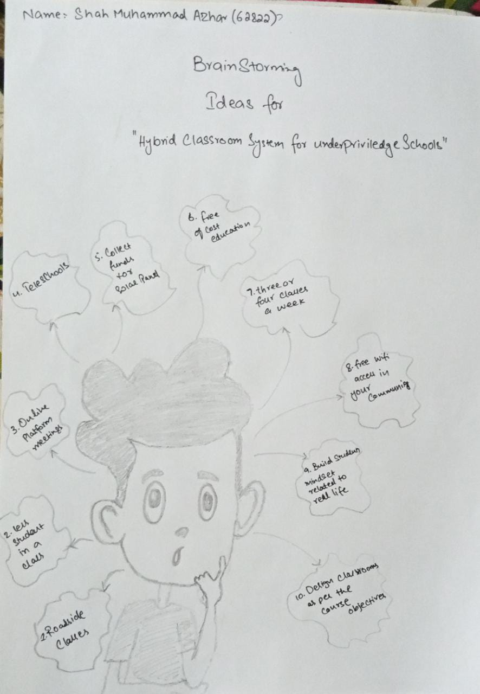

## BRAIN STORMING

## BRAIN STORMING SESSION PICTURE

## REFERENCES

* anonymous. (2006). Retrieved from https://www.globalgiving.org/projects/education-for-the-underprivileged/
* Solutions, T. (2008). Retrieved from https://edtechmagazine.com/k12/article/2018/01/rural-districts-face-challenges-and-opportunities-technology-access
